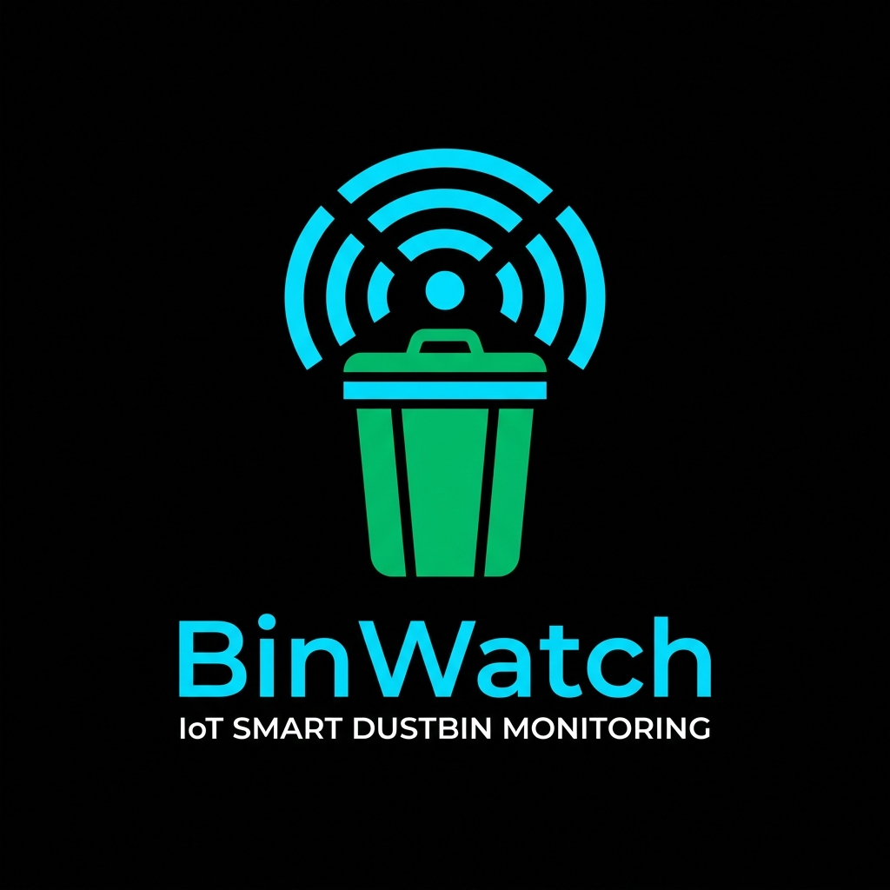
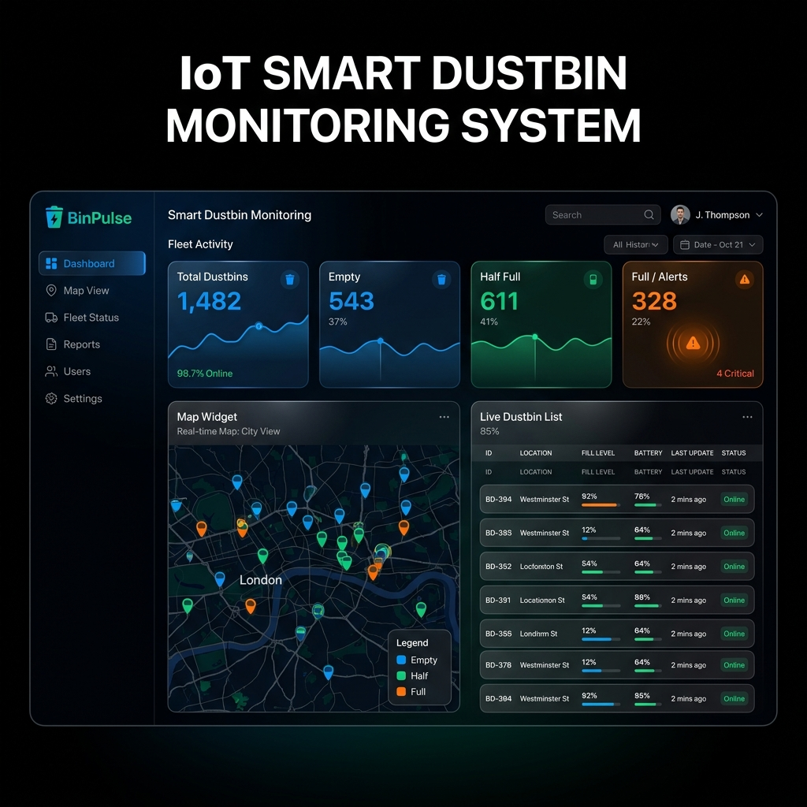
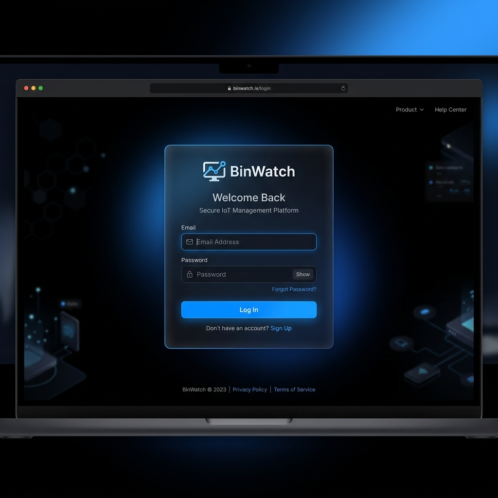
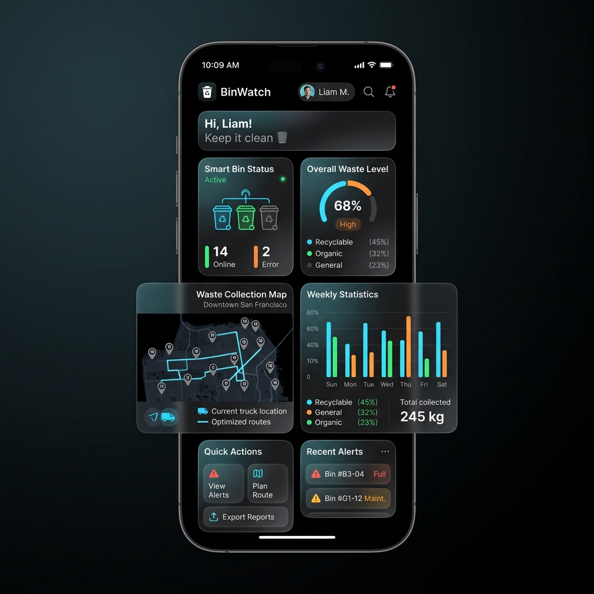

<div align="center">
  
  
  # BinWatch – A Smart Dustbin Monitoring System

  > **Powered by Ares**

  <p>A complete Hardware + Software + IoT ecosystem designed to optimize waste management through real-time monitoring, GPS tracking, and automated alerts.</p>

  [](https://opensource.org/licenses/MIT)
  [](https://github.com/yourusername/binwatch)
  [](https://github.com/yourusername/binwatch/issues)
  [](https://github.com/yourusername/binwatch/network/members)
  [](https://nodejs.org/)
  [](https://www.mongodb.com/)
  [](https://expressjs.com/)
  [](http://makeapullrequest.com)

  <p>
    <a href="https://binwatch-demo.com"><b>View Live Demo (Coming Soon)</b></a>
  </p>
  ---
</div>

## 📸 Screenshots

| Dashboard | Login | Mobile |
|:---:|:---:|:---:|
|  |  |  |

---

## 📑 Documentation Directory
Welcome to the BinWatch Documentation! We have structured our guides into specific, focused files to help you navigate our architecture.

- 🏗️ **[System Architecture](docs/Architecture.md)** - Learn about the data flow and system diagrams.
- 🔌 **[Hardware Integration](docs/Hardware.md)** - ESP8266 circuit diagrams, ultrasonic mapping, and GPS wiring.
- 💻 **[Software Architecture](docs/Software.md)** - MVC structure, Express.js backend, and WebSocket integration.
- 🗄️ **[Database Schema](docs/Database.md)** - Mongoose collections and Mermaid ER Diagrams.
- 📚 **[REST API Docs](docs/API.md)** - Detailed endpoints, auth requirements, and JSON payloads.
- 🚀 **[Deployment Guide](docs/Deployment.md)** - How to deploy on Render, Heroku, or DigitalOcean.
- 🛠️ **[Troubleshooting & FAQ](docs/Troubleshooting.md)** - Fixes for MongoDB, WebSockets, or ESP8266 bugs.

---

## 🌟 Project Highlights

- ✔ **Hardware + Software Integration**: True IoT ecosystem from edge to cloud.
- ✔ **Real-Time Updates**: DOM manipulation via WebSockets, eliminating API polling.
- ✔ **Live GPS Tracking**: Native Google Maps Javascript API integration.
- ✔ **Automated Email Alerts**: Instant administration alerts powered by Resend.
- ✔ **JWT Authentication**: Secure, stateless administrative login with bcrypt hashing.
- ✔ **Responsive Dashboard**: Beautiful, glassmorphic dark-theme UI compatible with all devices.
- ✔ **RESTful Standards**: Strict JSON APIs following industry best practices.
- ✔ **ESP8266 Compatible**: Simple JSON payload requirements for microcontrollers.

---

## 🛠️ Technology Stack

<div align="center">
  
</div>

- **Frontend**: HTML5, Vanilla CSS3 (Glassmorphism), JavaScript (ES6+), Google Maps API
- **Backend**: Node.js, Express.js, WebSockets (`ws`)
- **Database**: MongoDB Atlas, Mongoose
- **Security**: jsonwebtoken, bcrypt
- **Hardware**: ESP8266 (NodeMCU), HC-SR04, Neo-6M GPS

---

## 🚀 Getting Started

### 📁 Repository Tree
```text
binwatch/
├── .github/               # Community health files & templates
├── assets/                # Screenshots and AI generated logos
├── docs/                  # Detailed architectural markdown documentation
├── public/                # Frontend SPA files (HTML, modular CSS, JS)
├── src/                   
│   ├── config/            # Database connection logic
│   ├── controllers/       # Business logic (Auth, Dustbins)
│   ├── middleware/        # JWT Authentication guards
│   ├── models/            # Mongoose Schemas (NoSQL)
│   ├── routes/            # Express REST Routers
│   └── server.js          # Entry point & WebSocket Server
├── .env.example           # Environment configuration template
├── .gitignore             # Standardized git ignores
├── package.json           # Node dependencies
└── README.md              # Project Master Index
```

### Installation
1. Clone the repo: `git clone https://github.com/yourusername/binwatch.git`
2. Install Node dependencies: `npm install`
3. Copy `.env.example` to `.env` and insert your API keys (MongoDB, Resend, Google Maps).
4. Run locally: `npm run dev`

---

## 🗺️ Roadmap
- [x] Responsive Dashboard UI Redesign (Dark Theme)
- [x] GPS Integration via Google Maps
- [x] JWT Authentication & MVC Refactor
- [x] MongoDB Atlas Migration
- [ ] Mobile Application (React Native)
- [ ] AI Fill-Level Prediction Engine
- [ ] Route Optimization for Garbage Trucks
- [ ] Analytics & Historical Data Charts
- [ ] SMS Alerts via Twilio

---

## 🤝 Contributors & Acknowledgements

**Maintainer:** [Siddhant](https://github.com/siddhant)  
**Powered by Ares**

A massive thank you to the open-source communities behind:
- [Node.js](https://nodejs.org)
- [Express](https://expressjs.com)
- [MongoDB](https://mongodb.com)
- [Resend](https://resend.com)
- [Google Maps API](https://developers.google.com/maps)
- [ESP8266 Community Forums](https://www.esp8266.com/)

Please see our [CONTRIBUTING.md](.github/CONTRIBUTING.md) to get involved!

---

<div align="center">
  <i>BinWatch is released under the <a href="LICENSE">MIT License</a>.</i>
</div>
