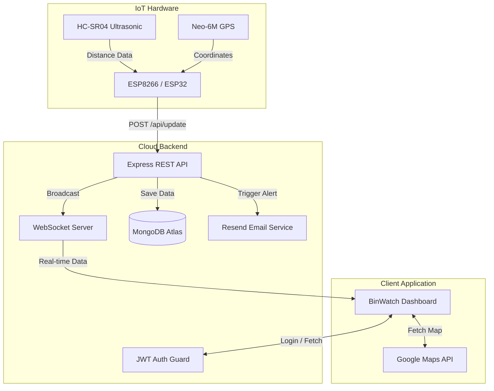
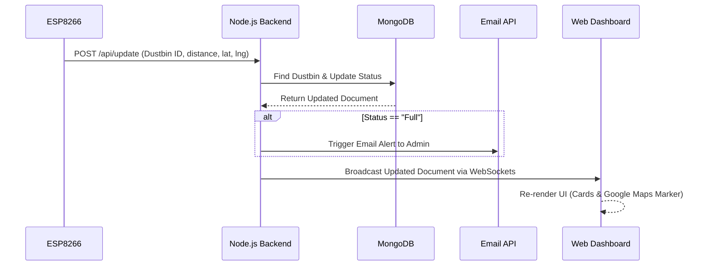

# Architecture

This document describes the high-level architecture of BinWatch.

## System Architecture Diagram

## Data Flow Workflow

## Design Principles

We built BinWatch adhering to the following design principles:
- ✔ **Scalability**: Capable of handling thousands of dustbins globally.
- ✔ **Maintainability**: Strict separation of concerns (MVC pattern).
- ✔ **Security**: No sensitive data is ever exposed; JWT handles stateless sessions.
- ✔ **Performance**: Minimal payload via WebSocket broadcasts instead of HTTP polling.
- ✔ **Accessibility**: UI follows Web Content Accessibility Guidelines (WCAG) for contrast and readability.
- ✔ **Modularity**: Frontend assets are component-driven and scoped.
- ✔ **Reusability**: Shared utility functions and database middleware for rapid expansion.
