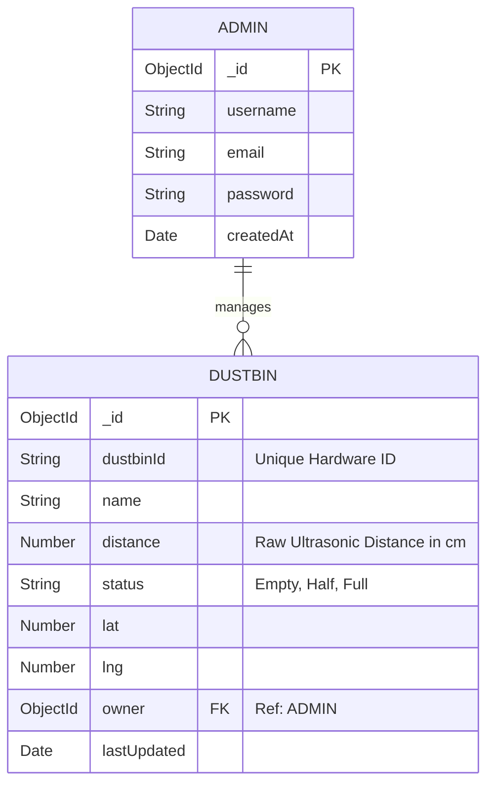

# Database Schema

BinWatch uses MongoDB Atlas to handle its NoSQL data storage. The data is modeled using Mongoose to enforce strict schema types.

## Entity Relationship (ER) Diagram

## Schema Definitions

### User Schema (`src/models/User.js`)
Handles the credentials for the dashboard administrators.
- `username` (String, Required, Unique)
- `email` (String, Required, Unique)
- `password` (String, Required) - Bcrypt hashed.

### Dustbin Schema (`src/models/Dustbin.js`)
Stores the real-time state of the hardware sensors.
- `dustbinId` (String, Required, Unique) - Must match the string hardcoded into the ESP8266.
- `name` (String, Required) - Human-readable name for the UI.
- `distance` (Number, Default: 0) - Populated by the hardware HTTP POST.
- `status` (String, Enum: ['Empty', 'Half', 'Full'], Default: 'Empty') - Computed dynamically by the server before saving.
- `lat` (Number, Required)
- `lng` (Number, Required)
- `owner` (ObjectId, Ref: 'User', Required) - The admin who created the dustbin tracking instance.
- `lastUpdated` (Date, Default: Date.now) - Time of the last successful hardware ping.
