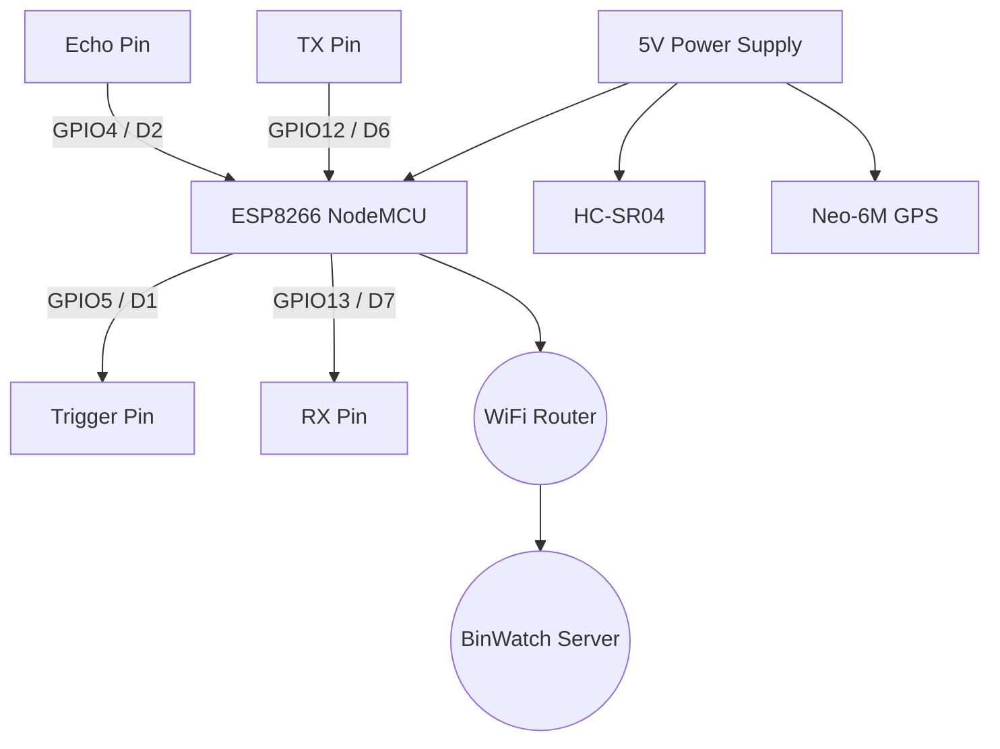

# Hardware Documentation

BinWatch operates on an embedded IoT ecosystem designed to be affordable and reliable.

## Core Components
- **Microcontroller**: ESP8266 (NodeMCU) or ESP32. Handles Wi-Fi and HTTP requests.
- **Sensor**: HC-SR04 Ultrasonic Distance Sensor. Calculates the depth of the trash.
- **Location**: Neo-6M GPS Module. Tracks the physical coordinates of the dustbin.
- **Power**: Standard 5V power bank or wall adapter via Micro-USB.

## Circuit Flowchart



## Hardware Wiring Overview

| Component | Pin | ESP8266 (NodeMCU) Pin | Description |
|-----------|-----|-----------------------|-------------|
| **HC-SR04** | VCC | Vin / 5V | Power |
|           | GND | GND | Ground |
|           | TRIG| D1 (GPIO5) | Trigger Pulse |
|           | ECHO| D2 (GPIO4) | Echo Receive |
| **GPS Neo-6M**| VCC | 3.3V | Power |
|           | GND | GND | Ground |
|           | TX  | D6 (GPIO12) | Software Serial RX |
|           | RX  | D7 (GPIO13) | Software Serial TX |

## Firmware Logic (Pseudocode)
```cpp
setup() {
  Connect to WiFi;
  Initialize Serial for GPS;
  Set Trigger to OUTPUT, Echo to INPUT;
}

loop() {
  distance = readUltrasonic();
  lat, lng = readGPS();
  
  if (WiFi is Connected) {
    payload = {
      "dustbinId": "DBN-12345",
      "distance": distance,
      "lat": lat,
      "lng": lng
    };
    HTTP.POST(SERVER_URL + "/api/update", payload);
  }
  
  delay(300000); // 5 Minutes Deep Sleep
}
```
